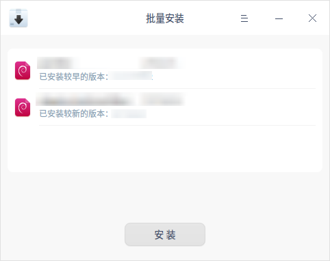
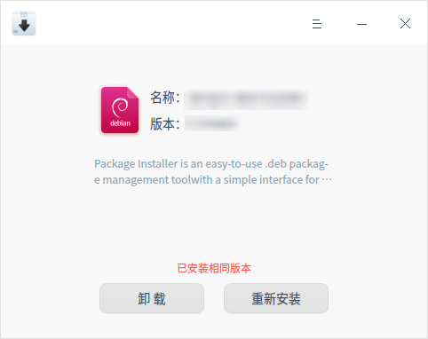

# 软件包安装器|deepin-deb-installer|

## 概述

软件包安装器是一款deb包和uab包管理工具，界面简单易用，支持批量安装、版本信息识别和依赖包自动补全等功能，帮助您快速的实现安装操作。

## 操作介绍

### 打开方式

您可以使用以下方法打开软件包安装器：

- 双击deb包或uab包，软件包安装器会自动启动并准备安装该软件包。
- 直接将deb包或uab包拖拽到软件包安装器的图标上打开应用。

### 安装

软件包安装器可以安装单个应用，也可以批量安装多个应用。

#### 单个安装

1.  在软件包安装器界面，您可以：
   - 单击 **选择文件** ，选择需要安装的软件包，单击 **打开**。
   - 直接将软件包拖拽到应用界面。
2.  单击 **安装**，弹出授权窗口，请输入密码授权。
3.  安装过程中可以单击  或  展开或收起安装进程信息。
4.  安装成功之后，单击 **完成** 退出，或者单击 **返回** 继续安装其他应用。

>  说明：当检测到已安装的软件版本高于或低于待安装的版本时，界面会显示 **安装旧版本** 或 **更新** 按钮，您可以根据需要退回到旧版本或更新到新版本。

#### 多个安装

软件包安装器可以通过拖拽和选择文件的方式一次性批量添加多个软件包，安装步骤请参考 [单个安装](#单个安装)，多个安装时请注意以下要点：

- 批量安装同样也可以查看安装进程。
- 批量安装时按钮只显示 **安装** 按钮。本地已安装其他版本的软件包执行安装操作，本地已安装相同版本的软件包执行重新安装操作。
- 批量安装列表内，选择一个安装包，单击鼠标右键选择 **删除** 可将安装包从列表中移除。

#### 无法安装

软件包安装器可以自动识别无法安装的包，有效规避安装后无法使用的问题。

常见的原因有：

- 软件包架构不匹配。
  

- 依赖关系不满足。  
  

- 安装包无数字签名。

- 安装包没有有效的数字签名。单击 **前往** 跳转安全中心进行设置。

### 卸载

当安装包已存在相同或其他版本时，可以使用软件包安装器执行卸载操作。

1.  在软件包安装器界面，您可以：
   - 单击 **选择文件** ，选择需要安装的软件包，单击 **打开**。
   - 直接将软件包拖拽到应用界面。
2. 单击 **卸载**。
3. 请注意界面上的卸载提示，单击 **确定卸载**，弹出授权窗口，请输入密码授权。
4. 卸载过程中可以单击  或  展开或收起卸载进程信息。
5.  卸载成功后单击 **完成**。

>  注意：卸载某些应用可能会对系统或其他软件产生影响，请谨慎操作。

## 主菜单

在主菜单中，您可以切换窗口主题、查看帮助手册、了解软件包安装器的更多信息。

### 设置

1. 在软件包安装器界面，单击 。d
2. 选择 **设置**。
3. 如需安装未签名应用，单击 **安全中心-安全工具-应用安全** 跳转安全中心应用进行设置。。

### 主题

窗口主题包含浅色主题、深色主题和系统主题。

1. 在软件包安装器界面，单击 。
2. 选择 **主题**，选择一个主题颜色。

### 帮助

查看帮助手册，进一步了解和使用软件包安装器。

1. 在软件包安装器界面，单击 。
2. 选择 **帮助**。
3. 查看软件包安装器的帮助手册。

### 关于

1. 在软件包安装器界面，单击 。
2. 选择 **关于**。
3. 查看软件包安装器的版本和介绍。

### 退出

1. 在软件包安装器界面，单击 。
2. 选择 **退出**。

